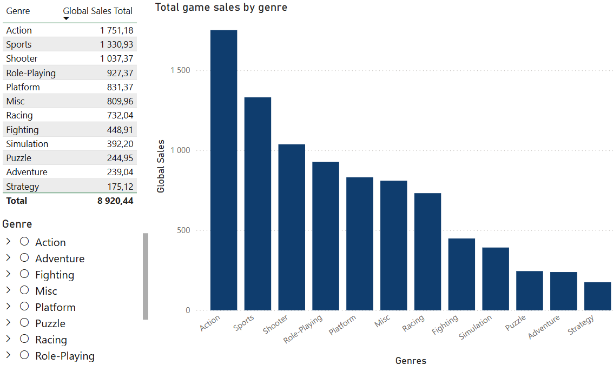
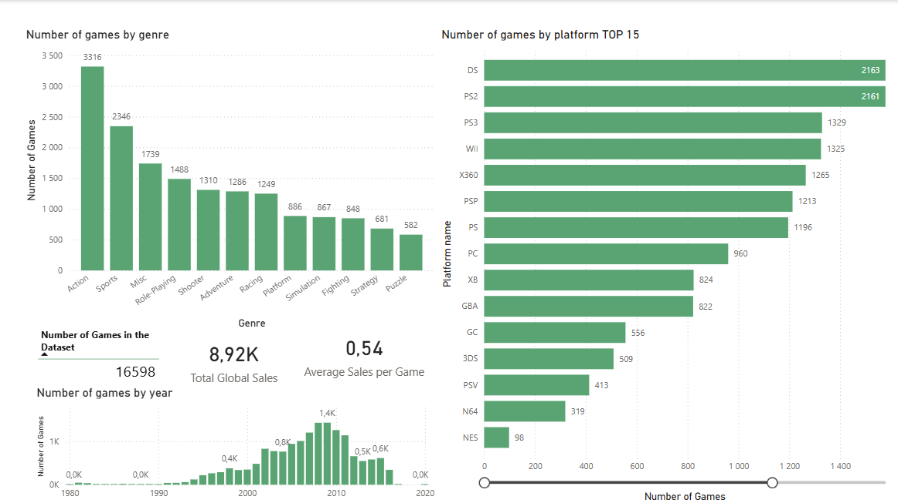
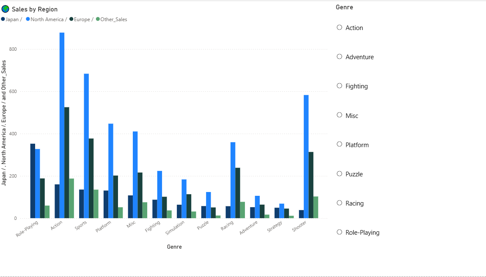
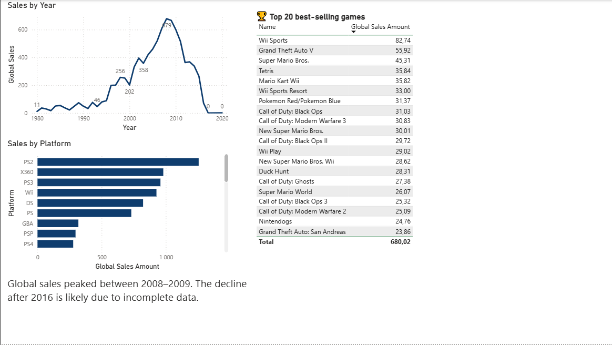

# video-game-sales-powerbi-dashboard
Data analysis project exploring video game industry trends, top genres, platforms, and regional markets using Power BI.

# 🎮 Video Game Sales Analysis (1980-2020)

## 📊 Project Overview
This project analyzes global video game sales data to identify key industry trends, popular genres, leading platforms, and regional market differences.
The goal is to better understand the evolution of the gaming industry and support data-driven decisions for game development, marketing, and investment.

---

## 🎯 Objectives
- Analyze trends in game releases over time  
- Identify the most popular and profitable genres  
- Compare platform performance  
- Discover top-selling games  
- Analyze regional market differences  

---

## 📂 Dataset
Source: Kaggle  
https://www.kaggle.com/datasets/gregorut/videogamesales

**Main fields used:**

Name          – Name of the game  
Platform      – Gaming platform (PS2, Xbox, etc.)  
Year          – Release year  
Genre         – Game genre  
Publisher     – Game publisher  

NA_Sales      – Sales in North America (millions)  
EU_Sales      – Sales in Europe (millions)  
JP_Sales      – Sales in Japan (millions)  
Other_Sales   – Sales in other regions (millions)  

Global_Sales  – Total worldwide sales (millions

---

## 🛠 Tools & Data Preparation
**Tool used:**
- Power BI  

**Data cleaning:**
- Removed missing values (N/A)  
- Corrected data types  
- Fixed regional formatting issues  
- Handled data errors  

---

## 📸 Dashboard Preview

---

## 📊 Key Metrics
- Total Global Sales  
- Average Sales per Game  
- Number of Games Released  

---

## 📈 Visualization Approach
- Bar charts → comparison (genres, platforms)  
- Line charts → trends over time  
- Tables → Top games  
- KPI cards → key metrics overview  
- Slicers → interactive filtering  

---

## 🧠 Key Insights

### 🎮 Industry Trends
- Game production peaked in **2008–2009**  
- Decline after 2016 is likely due to incomplete data  

---

### 🕹 Genre Analysis
- Most games: **Action, Sports, Misc**  
- Least games: **Fighting, Strategy, Puzzle**  
- Top-selling genres: **Action, Sports, Shooter**  

---

### 💿 Platform Analysis
- Most active: **Nintendo DS, PS2, PS3**  
- Most profitable: **PS2, Xbox 360, PS3**  

---

### 🏆 Top Games
- Wii Sports  
- GTA V  
- Super Mario Bros.  
- Tetris  
- Mario Kart Wii  

---

### 🌍 Regional Analysis
- #1 North America  
- #2 Europe  
- #3 Japan  

---

## 💡 Business Insights
- The US market is the most important for game sales  
- Launching games during new console releases increases success  
- Action and Sports genres dominate the market  
- Competition is highest on PS2, PS3, and Nintendo DS  

---

## 🚀 Future Improvements
- Add updated data  
- Build sales forecast  
- Analyze genre trends over time  
- Integrate SQL  

---

## 👤 About Me
This project was created to practice data cleaning and visualization in Power BI.

As a gaming enthusiast (especially retro games), I wanted to explore industry trends and understand what drives game success.

---

## 📎 Files
- `dashboard.pbix` – Power BI dashboard  
- `dataset.csv` – dataset  
